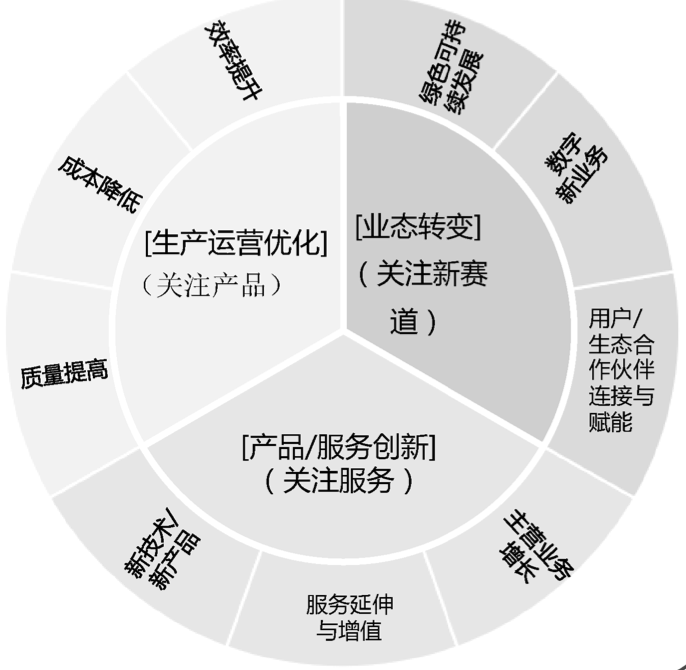

# My Understanding on DT

数字化大家感觉最直接的是什么?个人有不同感受; X年代习以为常的东西,对于我们当初可是特大进步;

我们小学的时候学校就门卫处有电话,然后还是手摇的,带电池的; 哪个时候重要的信息还是通过邮局的电报 Telegram, 邮递员投递的,而非 现在的Telegram APP.

<figure><figcaption></figcaption></figure>

高中的录取通知书都还是邮递员投递,而大学的分数是可以通过电话查询; 但存折还是纸质存折.等到硕士阶段,网络已经畅通;但各地的考验实体,居然还是通过发送打印出来发送邮件; 我们认识的一个兄弟就专门搜集各学校的试题,在硕士毕业的时候就开始创业了; 这比2015年的万众创业不知道早哪里去;

回顾这个历史,其实是要区分所谓的数字化可区分几种,或者有两个极端;

* 一种数字原生;本身就是信息
* 一种是完全传统的实际物理的制造;

当然,大部分企业都是其中的混合体; 但TMT (telecom,Media,Technology)和金融行业,天然的信息化比其他行业早; 特别是那些具备网络效应,天生就需要互联互通的;或者本身就是传递信息;天然就有行程标准的倾向; 而与平台不断解耦或者平台独立的特征;&#x20;

所以,2003年非典后,电商兴起,那个时候做C2C的淘宝Mommy们不会关心数字化转型的概念,而是电子商务; 2011年后智能手机的兴起,微信带来的微商,快手抖音带来的直播电商;他们也不关心数字化转型;鱼儿在水中感觉不到水的存在,但游的自由自在;

当华为在内部的材料出版,《华为数据之道》,这个时候提出一个“非数字原生”企业的数字化转型的概念,马上引起了强烈共鸣;

* 首先,及时信息化走在前列的电信运营商,本身也有很多非数字原生的环节;或者说,凡是设计到无缘物料的, 如宽带线路资源的可用性和可用度,总是问题;
* 其次,大国重器,本身设计到制造的工业; 在工业4.0提出来后,也继续将供应链过程,制造过程数字化;
* 技术的发展,特别是大数据的发展.以及基大数据上的数据处理手段,让以前的在人工智能遭遇冬季的神经网络起死回生;对非结构化数据的处理手段的不断增情;特别是图片识别,语音识别,NPL 直到现在的LLM 基于大数据的大语言模型;

于是,一切都在改变的档口; 回到 [数字化转型的定义,](definition-of-the-dt.-digital-transformation.md)  数字化转型的核心在于数字化,转型是目的,是目标; 转型本身不是必须入化蛹成蝶般变态; 可以是延长线的优化;简单的不改变打下的业务流程,而是在数字化的基础上不断提升效率; 如丰田的精益生产, 还是生产制造;只是从消除“浪费”的目的下,不断优化信息流,物流...

而有的其实是重构了整个流程; 这个可以参见以前的流程再造的相关案例; 或者当下各种的平台经济;&#x20;

<figure><figcaption></figcaption></figure>

数字化转型会嵌入到企业整个价值链的方方面面,不仅仅是优化当前流程,也可能会创新产品形态; 例如运营商的数据化变现; (当然,在满足法律法规的前提下.) 甚至基于数据提出新赛道; 例如,新兴市场的国家们,在银行覆盖不足的I房,利用运营商网络的普遍覆盖,提供Mobile Money 的服务;

数字化转型不是没有成本,一定要对自己有利可图的时候再去转,而非为了转而转; 特别对于大部分自负盈亏的SME甚至家庭企业而言; 大部分都是在营销Marketing& Sale的环节,尽量利用信息化的手段来进行改造; 从这一点上来讲,其实没有所谓原生与否; 毕竟不管是什么服务,都绕不开交易这一环节,而且应该是交易驱动;&#x20;

从这个角度来讲,证券股票赌博行业,是天生最纯粹的数字化行业;&#x20;

